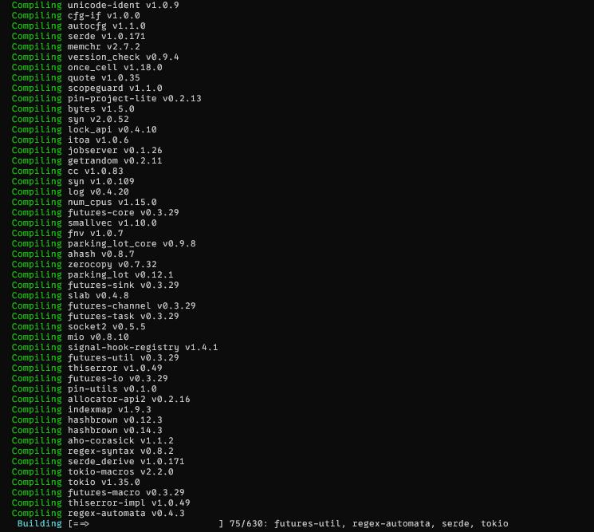
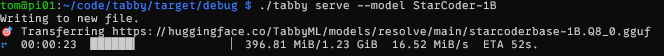
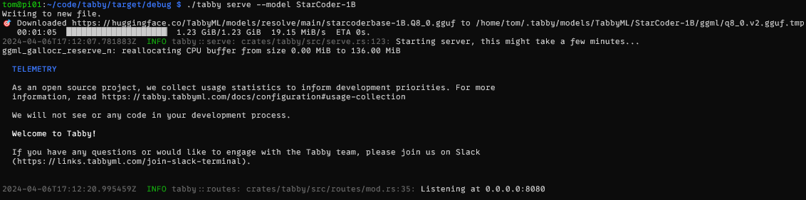
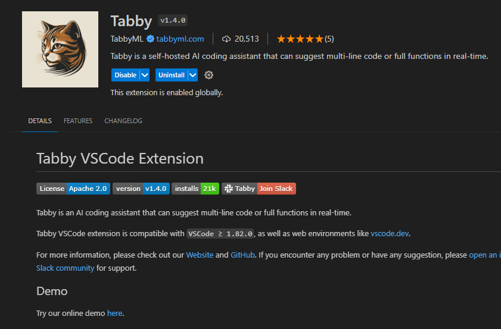
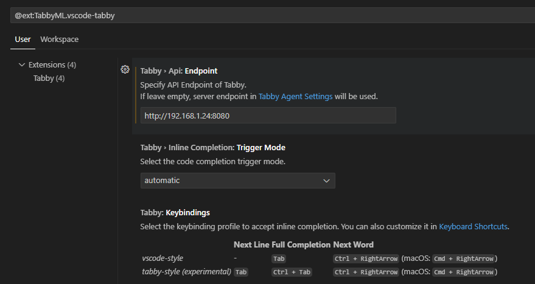
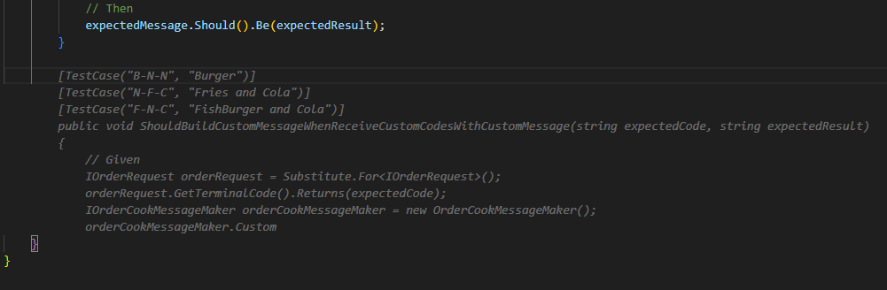
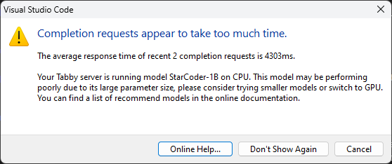

I recently discovered an AI-powered coding assistant that you can self-host at home, sends no requests to the internet, requires no cloud service, and is free and open-source. That assistant is called `TabbyML`.

On the **TabbyML** website (see sources), you can see that the tool can be installed quickly on Linux, Mac, or Windows. It supports more than ten languages _(C / C++ / C# / Java / Go / Rust / Python / PHP...)_, which is very convenient. It also integrates with **Visual Studio Code**, **IntelliJ platform** _(PyCharm, GoLand, CLion...)_, and **VIM** for the purists among us.

With that in mind, and having just received my new Raspberry PI, I decided to give it a try! 😁

## How Tabby works

To use Tabby, you simply install it and run it. At startup, you can choose which model it should use. You can also run it in CPU mode or CUDA mode for those with a compatible Nvidia GPU. It can be run via **Docker**, but in my tests, I preferred running it directly on my machine.

## Test on a Raspberry PI 5 (8GB)

### 1. Installing Tabby

Installation on a Raspberry PI is not documented, but the source is written in _Rust_, so it can be compiled.

I had to try several times to get it working because I was missing some libraries. For anyone curious who wants to reproduce the experience, here are the commands I had to run over SSH on the Pi.

```bash
# rust install
curl https://sh.rustup.rs -sSf | sh
# select choice '1'
# Needed to compile Tabby
sudo apt install -y protobuf-compiler libopenblas-dev \
libssl-dev cmake
# compile
cargo build -r
```

*Compilation took quite a while...* ☕



The compilation worked and I was very happy to be able to test it! 👌😊

### 2. Launching Tabby

Once compiled, I had to start it. Based on the documentation, I decided to launch it with the simplest model (let's not forget we're running on a Raspberry).

The list of models is available on the Tabby website [**here**](https://tabby.tabbyml.com/docs/models/)

```bash
./tabby serve --model StarCoder-1B
```

On first launch, it automatically downloads the model.



Then it starts the server. Note that it runs by default on port _8080_ on _localhost_.



### 3. Setting up the client

Since Tabby works with Visual Studio Code, I decided to use it as the client to test Tabby. Installation was straightforward, as a Tabby plugin is available. Configuration was also simple: in the settings, I just defined the IP address of my Raspberry and the port.





Once installed, a small Tabby area appears at the bottom of the editor.


### 4. Testing

For this test, I used code from a Kata I had written some time ago. It worked, but performance was not great - which doesn't surprise me since a Raspberry Pi isn't really suited for running AI.

## Test on a standard PC

I wanted to test on my PC to see how it would perform. In terms of installation, Tabby offers a binary download for Windows, which was much simpler than compiling from the Pi.

[Link to Tabby releases](https://github.com/TabbyML/tabby/releases)

I ran tests in both CPU and CUDA mode. Here's some context about the configuration:

- CPU: i7-12700k
- GPU: RTX-2070-super
- Drive: Crucial MX500 SSD

## Results

Test of a unit test generation suggestion:

[Source file](https://github.com/heka95/Katas/blob/main/BurgerMachineKata/Solution/BurgerMachine.Tests/OrderCookMessageMakerTest.cs)

Expected suggestion (I didn't always get the same response, which is normal for a generative AI)



| _Configuration_ | _Average time_ |
|----------------|----------------|
| PI 5 | ~28-35s |
| X64 CPU | ~2-5s |
| CUDA GPU | Near-instant |

**Note:**

During tests with the PI and in CPU mode, I noticed that the `Tabby` icon in Visual Studio Code's status bar turned yellow. Clicking on it revealed the following message:



_It is however possible to tell it to stop showing the error to work around the issue._

## Conclusion

Tabby is a fairly effective tool for AI-powered code completion. It is very useful for developers who want to code quickly. Even though it's not as relevant as paid solutions like *Copilot*, it remains accessible and free, making it an interesting alternative.

I was able to experiment with other profiles using a better dataset and noticed more efficient completion, but GPU usage is mandatory in that case. Otherwise, you'll find yourself waiting very frequently for processing, which is frustrating.

- I didn't mention it earlier, but it's possible to switch it to _manual_ mode. In this mode, you can use a key combination to trigger it, which prevents the CPU/GPU from running almost constantly while writing code.

- While writing this article, I also noticed that it can assist with text writing, making it a documentation assistant as well. That was a nice discovery - I didn't know it could do that.

- There is a more complete paid version as well as an administration interface for businesses. I didn't test it since I didn't feel the need, but it's worth knowing.

_I think using it via a small external computer or via your own CPU isn't very effective. I would recommend it more to people with a GPU or a dedicated server. For a small company or a freelancer looking for AI-assisted coding, I think it's an interesting tool._

## Sources

- [Official TabbyML website](https://tabby.tabbyml.com/)
