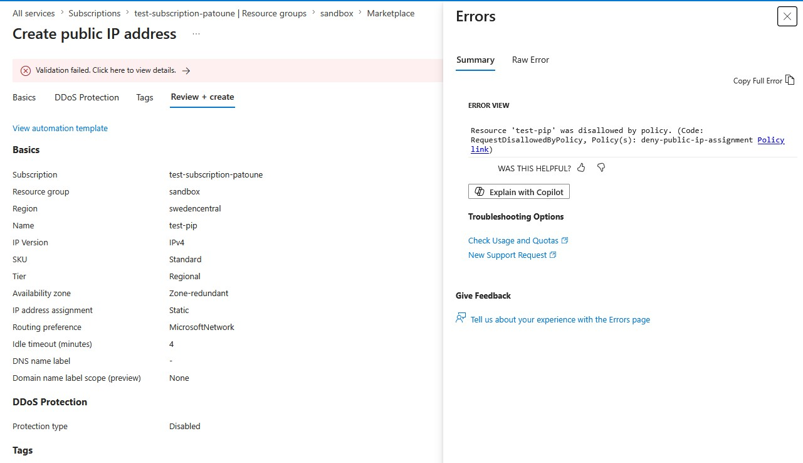
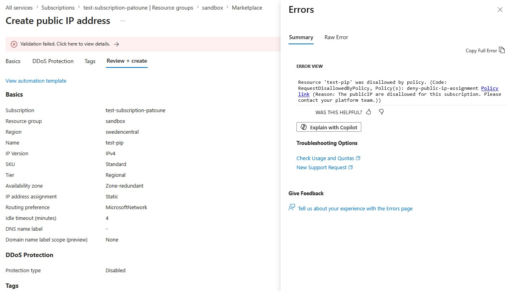

Par défaut, lorsqu'une Azure Policy bloque une opération, le message retourné est générique et peu exploitable.

## Le problème

Pour illustrer cela, j'ai créé une policy très simple qui va empêcher la création d'une IP publique.

```json
{
  "policyRule": {
    "if": {
      "field": "type",
      "equals": "Microsoft.Network/publicIPAddresses"
    },
    "then": {
      "effect": "Deny"
    }
  },
  "versions": ["1.0.0"]
}
```

L'erreur par défaut ressemble à ceci :

```
Resource 'test-pip' was disallowed by policy. (Code: RequestDisallowedByPolicy, Policy(s): deny-public-ip-assignment
```



Sans contexte, sans alternative, sans indication sur quoi faire. C'est frustrant pour l'utilisateur et c'est aussi générateur de tickets inutiles pour l'équipe plateforme.


## Ajouter un non-compliance message

Lors de l'exécution de mon assignement, j'ai ajouté un message permettant de comprendre pourquoi cette policy bloque la création d'adresse IP publique.

Ceci se fait simplement par l'ajout d'un message durant l'assignement de la policy :

```powershell
$msg = @(@{Message ="The publicIP are disallowed for this subscription. Please contact your platform team."})

New-AzPolicyAssignment -Name "deny-public-ip-assignment" -PolicyDefinition $definition -Scope "/subscriptions/$sub" -NonComplianceMessage $msg
```

## Où le message apparaît

Lorsqu'on tente de refaire l'opération qui consiste à créer une Public IP, on constate que le message a changé :



C'est à présent bien plus clair et on donne ainsi un sens fonctionnel à cette restriction.

## Bonnes pratiques

**Répondre à trois questions :** pourquoi c'est bloqué, quelle est l'alternative, à qui s'adresser.

**Inclure un lien ou un canal.** Un lien vers la documentation interne ou un canal Slack réduit le temps de résolution.

**Rester court.** ARM tronque les messages trop longs. Viser 200-300 caractères maximum.

**Adapter le niveau.** Le message est lu par un développeur face à une erreur de déploiement, pas par l'équipe plateforme.

## Limitation importante

⚠️ `NonComplianceMessage` ne fonctionne qu'avec l'effet `Deny`. Pour `Audit`, `AuditIfNotExists` ou `DeployIfNotExists`, le champ est ignoré.

> Un seul champ JSON qui peut transformer une expérience de blocage opaque en feedback actionnable. À activer systématiquement sur toutes vos policies Deny.