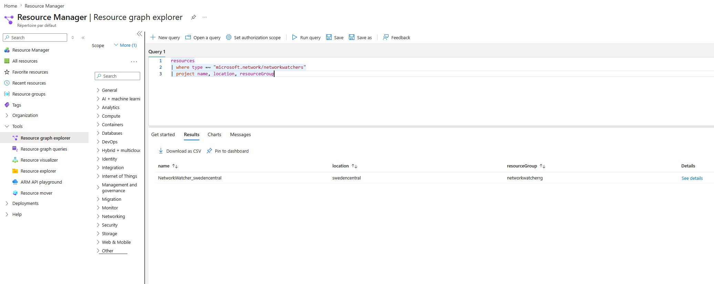

Le portail Azure propose des vues de conformité pour les Azure Policies, mais elles sont limitées : pas de filtrage cross-subscription avancé, pas d'export facile, pas de combinaisons complexes de critères. Azure Resource Graph résout ça via KQL qui est le même langage que Log Analytics, appliqué aux métadonnées de vos ressources Azure.

## Qu'est-ce qu'Azure Resource Graph ?

Azure Resource Graph est un service qui indexe toutes vos ressources Azure et leur état. Il permet d'interroger en quelques secondes l'ensemble de votre tenant, toutes subscriptions confondues et avec KQL (Kusto Query Language).

Deux tables sont particulièrement utiles pour la gouvernance :

- `resources` : toutes vos ressources Azure avec leurs propriétés
- `policyresources` : l'état de conformité des policies et assignments

## Accéder à Resource Graph

**Portail Azure :** chercher "Resource Graph Explorer" dans la barre de recherche.

**CLI :**

```bash
az graph query -q "resources | count"
```

**PowerShell :**

```powershell
Search-AzGraph -Query "resources | count"
```



## Requêtes de base

### Compter les ressources par type

```kql
resources
| summarize count() by type
| order by count_ desc
```

### Lister les ressources sans tag "environment"

```kql
resources
| where isempty(tostring(tags['environment']))
| project name, type, resourceGroup, subscriptionId
```

### Ressources dans une région spécifique

```kql
resources
| where location == "francecentral"
| project name, type, resourceGroup
| order by type asc
```

## Requêtes de conformité Policy

### État de conformité global par assignment

```kql
policyresources
| where type == "microsoft.policyinsights/policystates"
| where properties.policyAssignmentName != ""
| summarize
    total = count(),
    compliant = countif(properties.complianceState == "Compliant"),
    nonCompliant = countif(properties.complianceState == "NonCompliant")
    by tostring(properties.policyAssignmentName)
| extend complianceRate = round(100.0 * compliant / total, 1)
| order by nonCompliant desc
```

### Ressources non-conformes pour un assignment spécifique

```kql
policyresources
| where type == "microsoft.policyinsights/policystates"
| where properties.complianceState == "NonCompliant"
| where properties.policyAssignmentName == "initiative-storage-bu1-prd"
| project
    resourceId = properties.resourceId,
    resourceType = properties.resourceType,
    policyDefinitionName = properties.policyDefinitionName,
    timestamp = properties.timestamp
| order by timestamp desc
```

### Trouver les Storage Accounts avec accès public activé

```kql
resources
| where type == "microsoft.storage/storageaccounts"
| where properties.publicNetworkAccess == "Enabled"
    or properties.allowBlobPublicAccess == true
| project name, resourceGroup, subscriptionId, location,
    publicNetworkAccess = properties.publicNetworkAccess,
    allowBlobPublicAccess = properties.allowBlobPublicAccess
```

### Ressources sans Private Endpoint

```kql
resources
| where type == "microsoft.keyvault/vaults"
| where array_length(properties.privateEndpointConnections) == 0
    or isnull(properties.privateEndpointConnections)
| project name, resourceGroup, subscriptionId
```

## Requêtes avancées multi-subscriptions

Un des grands avantages de Resource Graph : les requêtes traversent automatiquement toutes les subscriptions auxquelles vous avez accès.

### Inventaire des AKS par version Kubernetes

```kql
resources
| where type == "microsoft.containerservice/managedclusters"
| project name, resourceGroup, subscriptionId, location,
    kubernetesVersion = properties.kubernetesVersion,
    nodeResourceGroup = properties.nodeResourceGroup
| order by kubernetesVersion asc
```

### Clusters AKS avec des versions obsolètes

```kql
resources
| where type == "microsoft.containerservice/managedclusters"
| extend version = split(properties.kubernetesVersion, ".")
| extend minorVersion = toint(version[1])
| where minorVersion < 29   // Adapter selon les versions supportées
| project name, resourceGroup, subscriptionId, kubernetesVersion = properties.kubernetesVersion
```

## Exporter les résultats

Depuis le portail Resource Graph Explorer, les résultats peuvent être téléchargés en CSV. Depuis la CLI :

```bash
az graph query \
  -q "resources | where type == 'microsoft.storage/storageaccounts' | project name, resourceGroup" \
  --output table > inventaire-storage.txt
```

## Intégration avec Azure Monitor Workbooks

Les requêtes Resource Graph peuvent être directement utilisées dans des Azure Monitor Workbooks pour créer des tableaux de bord de conformité automatisés sans avoir à exporter manuellement les données. C'est le sujet d'un article à venir sur les Workbooks Policy.

## Limitations

- Resource Graph ne retourne pas plus de 1000 résultats par requête sans pagination.
- Les données ont un délai de synchronisation (quelques minutes à quelques heures pour les nouvelles ressources).
- Certaines propriétés profondes des ressources ne sont pas indexées.

> 🚨 Resource Graph n'indexe que le plan de gestion (control plane) : il ne restitue ni les données Entra ID, ni le contenu du plan de données (data plane) des ressources. Par exemple, impossible d'obtenir les API exposées par une APIM, les secrets d'un Key Vault ou les messages d'une Service Bus.