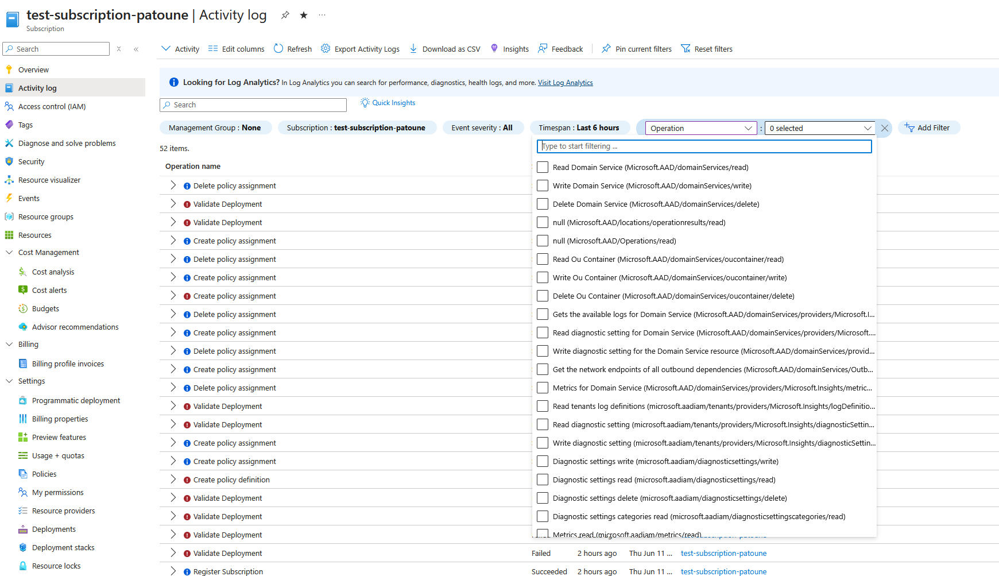
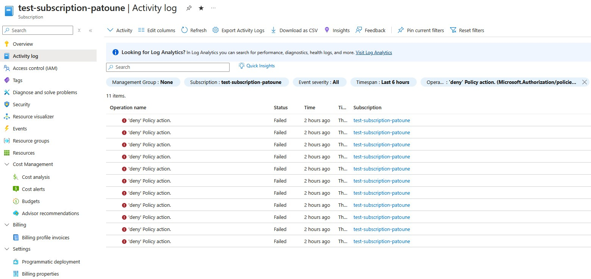
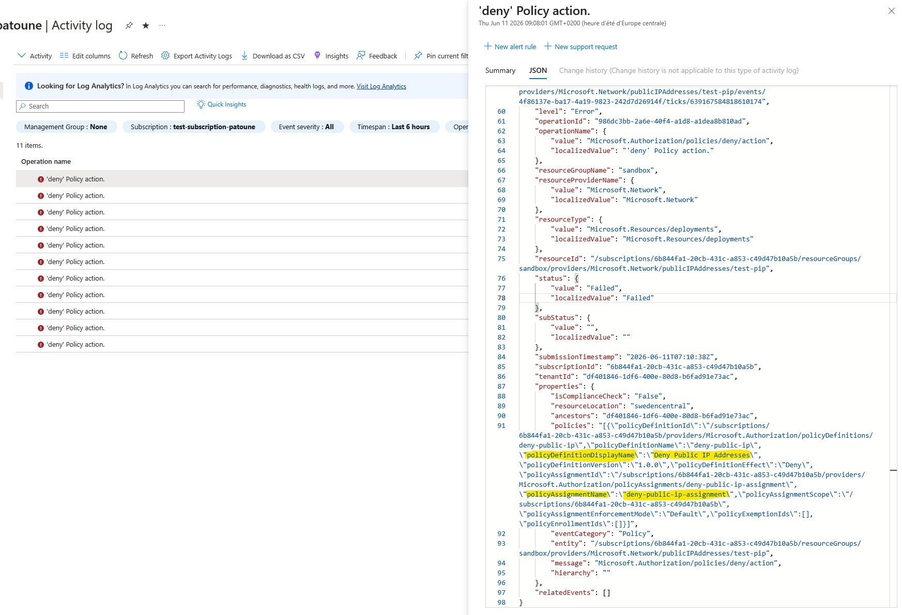

When an Azure Policy blocks a deployment, the error message in Terraform or in the portal often shows the responsible assignment but not always the full detail of the violated rule. Azure Activity Logs keep a complete trace of every denial.

## Where to look in the portal

Activity Logs are accessible from several places: at the subscription level, resource group level, or directly from a resource. To diagnose a Policy Deny, go to **Activity Log**.



## Filtering Policy events

Events related to Azure Policies have an operation type of `Microsoft.Authorization/*`.

To isolate Deny events:

1. In the Activity Log, click **Add filter**
2. **Operation** filter: search for `Microsoft.Authorization/policies`
3. **Status** filter: `Failed` (Deny events appear as failed operations)
4. Adjust the time range as needed



## Reading the detail of a Deny event

Click on an event to see the detail. The key information is in the **JSON** tab of the event.

The `policies` field contains:

- `policyAssignmentName`: the name of the assignment that triggered the Deny
- `policyDefinitionName`: the specific policy within the initiative
- `policySetDefinitionName`: the parent initiative (if applicable)



## Via PowerShell

To filter from the command line over the last 24 hours:

```powershell
$startTime = (Get-Date).AddHours(-24)

Get-AzActivityLog `
  -ResourceGroupName "my-rg" `
  -StartTime $startTime `
  -Status "Failed" |
  Select-Object EventTimestamp, Caller, ResourceId, Status
```

To get the full JSON detail of a specific event:

```powershell
$startTime = Get-Date "2024-12-10T08:00:00Z"

Get-AzActivityLog `
  -ResourceGroupName "my-rg" `
  -StartTime $startTime `
  -Status "Failed" |
  Select-Object -First 1 |
  Select-Object -ExpandProperty Properties |
  ConvertTo-Json -Depth 10
```

## Via KQL in Log Analytics

If Activity Logs are sent to a Log Analytics workspace (recommended in production):

```kql
AzureActivity
| where OperationNameValue startswith "microsoft.authorization/policies"
| where ActivityStatusValue == "Failed"
| extend policyInfo = parse_json(Properties).policies
| project
    TimeGenerated,
    Caller,
    ResourceId,
    OperationName,
    policyInfo
| order by TimeGenerated desc
```

This is a quick way to diagnose why a deployment failed.

> 💡 In another article, I covered a system for customizing `Deny` messages in a policy. Setting up these messages will save time on future Activity Log investigations.
