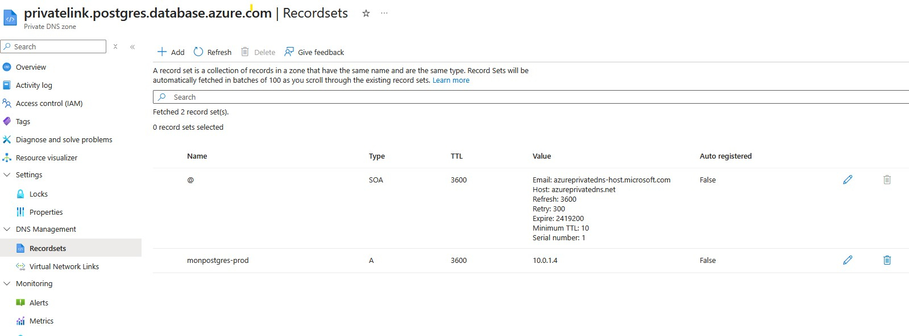
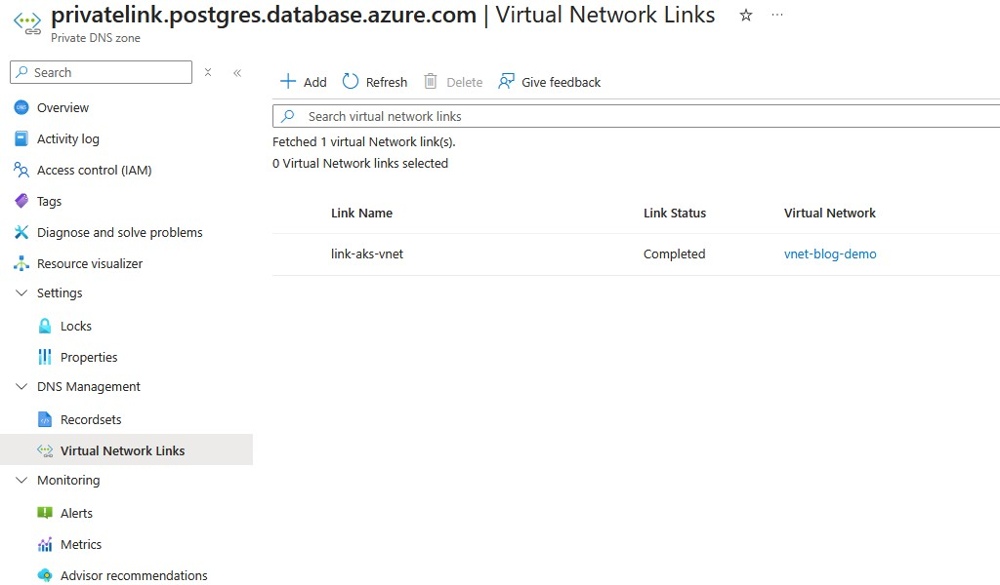

Azure Private Endpoints attach a managed service (PostgreSQL, Key Vault, Storage...) to the private network via an internal IP. The challenge: for AKS pods to resolve the FQDN of that resource to its private IP rather than its public IP, you need to correctly configure private DNS zones and Virtual Network Links.

## Architecture of the problem

When Azure creates a Private Endpoint for, say, a PostgreSQL Flexible Server, it automatically creates a private DNS zone of the form `privatelink.postgres.database.azure.com`. This zone contains an A record mapping the server's FQDN to the Private Endpoint's private IP.

But for VMs (and AKS pods) in a VNet to use this private DNS zone, you need to create a **Virtual Network Link** between the private zone and the AKS cluster's VNet.

Without this link, AKS pods will resolve the FQDN via Azure's public DNS and may get the private IP (Azure DNS still returns the private IP for private endpoints in the same tenant), but if the cluster is in a different VNet without peering or the correct VNet Link, resolution will fail.



## Private DNS zones per service

Each Azure resource type has its own private DNS zone for Private Endpoints:

| Service                    | Private DNS zone                          |
| -------------------------- | ----------------------------------------- |
| PostgreSQL Flexible Server | `privatelink.postgres.database.azure.com` |
| Azure SQL Database         | `privatelink.database.windows.net`        |
| Key Vault                  | `privatelink.vaultcore.azure.net`         |
| Storage Account (blob)     | `privatelink.blob.core.windows.net`       |
| Azure Container Registry   | `privatelink.azurecr.io`                  |

## Configuring the Virtual Network Link

### What a Virtual Network Link actually is

A Virtual Network Link is not a network rule or a tunnel — it is purely a **DNS authorization**.

> It tells Azure: "this VNet is allowed to query this private DNS zone."

Without the link, when a pod makes a DNS query, the Azure resolver[^azure-dns-ip] ignores the private zone and cannot find an answer:

```
AKS pod → DNS query → Azure resolver 168.63.129.16
                              ↓
                    VNet linked to the zone? ❌
                              ↓
                    zone ignored → resolution fails
```

With the link:

```
AKS pod → DNS query → Azure resolver 168.63.129.16
                              ↓
                    VNet linked to the zone? ✅
                              ↓
                    returns the Private Endpoint's private IP
```

That's it. No additional network configuration — just this link between the VNet and the zone.

### In Terraform:

```hcl
# Private DNS zone (declared explicitly; in the portal, the Private Endpoint DNS integration can create it for you)
resource "azurerm_private_dns_zone" "postgres" {
  name                = "privatelink.postgres.database.azure.com"
  resource_group_name = azurerm_resource_group.main.name
}

# Link between the private zone and the AKS VNet
resource "azurerm_private_dns_zone_virtual_network_link" "postgres_aks" {
  name                  = "link-postgres-aks-vnet"
  resource_group_name   = azurerm_resource_group.main.name
  private_dns_zone_name = azurerm_private_dns_zone.postgres.name
  virtual_network_id    = azurerm_virtual_network.aks.id
  registration_enabled  = false   # No auto-registration of VMs
}
```



## The PostgreSQL Flexible Server case

PostgreSQL Flexible Server is slightly more complex because it uses a different private DNS zone depending on the deployment mode. In Private Access mode (VNet Integration) without a Private Endpoint, it relies on a zone of the form `<server-name>.private.postgres.database.azure.com`. In Private Endpoint mode, it uses `privatelink.postgres.database.azure.com`.

### Verifying resolution from a pod

```bash
# Launch a temporary debug pod
kubectl run dns-test --image=nicolaka/netshoot --rm -it --restart=Never -- bash

# Inside the pod, test resolution
nslookup my-server.postgres.database.azure.com
nslookup my-server.privatelink.postgres.database.azure.com

# Test TCP connectivity
nc -zv my-server.postgres.database.azure.com 5432
```

If `nslookup` returns a `10.x.x.x` IP (the Private Endpoint's private IP), resolution is working. If it returns a public IP or an NXDOMAIN error, the Virtual Network Link is missing or misconfigured.

## Split-horizon DNS

Split-horizon (or split-brain DNS) is the situation where the same FQDN returns a different IP depending on where the query originates:

- From the Azure VNet (with the VNet Link) → Private Endpoint's private IP
- From the internet → public IP (or NXDOMAIN if public access is disabled)

This is the expected and desired behavior with Private Endpoints. AKS pods, being inside the VNet, should always receive the private IP.

## Common pitfalls

**VNet Link on the wrong VNet.** If AKS is in VNet A but the Private Endpoint is in VNet B (connected via peering), the VNet Link must be created on **VNet A** (the AKS cluster's VNet), not VNet B.

**Multiple VNets in a hub-and-spoke.** In a hub-and-spoke architecture, the private DNS zone is often linked to the hub VNet. For pods in a spoke VNet to resolve, you either need to link the zone to each spoke, or ensure the spoke's DNS forwards queries to the hub's DNS (Azure DNS Resolver).

**CoreDNS / kube-dns.** CoreDNS in AKS forwards non-Kubernetes queries to Azure DNS (168.63.129.16). If Azure DNS can resolve via the private zone (thanks to the VNet Link), everything works. If not, the query goes to public DNS and returns the public IP.

## Final check

```bash
# From a pod in the cluster
kubectl run dns-check --image=alpine --rm -it --restart=Never -- sh -c "
  apk add --no-cache bind-tools postgresql-client &&
  nslookup my-server.postgres.database.azure.com &&
  psql -h my-server.postgres.database.azure.com -U adminuser -c 'SELECT version();'
"
```

## Resources

- [What is IP address 168.63.129.16?](https://learn.microsoft.com/en-us/azure/virtual-network/what-is-ip-address-168-63-129-16)
- [Azure Private DNS overview](https://learn.microsoft.com/en-us/azure/dns/private-dns-overview)
- [Virtual network links](https://learn.microsoft.com/en-us/azure/dns/private-dns-virtual-network-links)

[^azure-dns-ip]: `168.63.129.16` is Azure's virtual DNS resolver IP, identical across all VNets. It is reserved by Microsoft and only reachable from inside a VNet. [Microsoft documentation](https://learn.microsoft.com/en-us/azure/virtual-network/what-is-ip-address-168-63-129-16)
