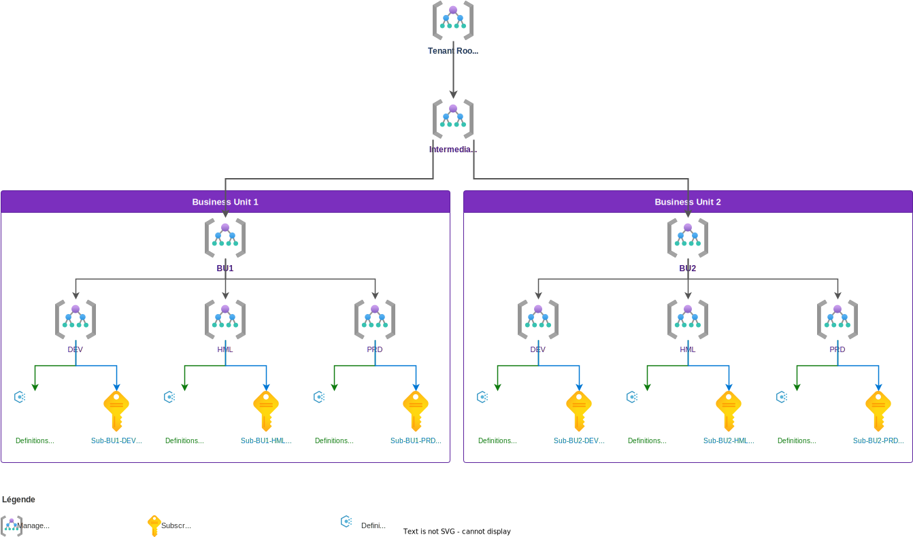

## What is an Azure Policy?

An Azure Policy is a governance rule applied to Azure resources. It ensures that an environment remains compliant with defined standards: security, naming conventions, allowed regions...

There are three key concepts to distinguish.

A **Policy Definition** is the rule itself. It defines what is evaluated and the effect triggered in case of non-compliance. The main effects are:

| Effect | Behavior |
|---|---|
| `Audit` | Logs non-compliance, does not block |
| `Deny` | Blocks resource creation or modification |
| `DeployIfNotExists` | Automatically deploys an associated resource if absent |
| `Modify` | Modifies a property during creation/update |
| `Append` | Adds fields to the resource |

An **Initiative** (or `PolicySetDefinition`) is a grouping of multiple definitions. Rather than assigning each policy one by one, they are grouped into a coherent initiative, for example a security baseline or CIS compliance set.

An **Assignment** is what links a policy definition or initiative definition to a **scope**: Management Group, Subscription, or Resource Group. Without an assignment, a policy has no effect.


A policy can be assigned directly or via an initiative, but in practice, using initiatives greatly simplifies management at scale. Think of initiatives as folders for grouping policies.

## Field constraints and the need to disable certain policies

On paper, a policy applies uniformly across its entire scope.

In practice, it's rarely that simple. You may encounter various use cases that justify *disabling* certain policies:

- A team needs a temporary exception
- A dev environment should not be blocked by a rule designed for prod
- A legacy resource cannot yet be brought into compliance

### The DoNotEnforce approach and its limits

The most direct solution is to use `DoNotEnforce` mode on the assignment. When enabled, the policy is still evaluated (it reports compliance results) but produces no blocking effect.

A `Deny` becomes silent, a `DeployIfNotExists` no longer triggers automatically during resource creation or update.

`DoNotEnforce` works for a single policy as well as for an entire initiative: it is a property of the assignment, not the definition.

📝 Note: manual remediation tasks *can* still be triggered in `DoNotEnforce` mode, which allows testing a `DeployIfNotExists` behavior during validation without risking blocking anything.

It is often used as a **safety net during a deployment**: assign the initiative in `DoNotEnforce` mode to observe compliance results without risking breaking anything, then switch to `Default` once confident about coverage.

⚠️ There is another less obvious field risk: if a policy is assigned in `Default` mode and a script then switches it to `DoNotEnforce`, there is a window of a few seconds to a few minutes during which the policy is active. A `Deny` in that window can block resource creation mid-deployment and cause a service interruption.

The good news: **Azure allows deploying an assignment directly in `DoNotEnforce` from the moment of creation**, without going through a `Default` phase. There is therefore no reason to accept this risk.

[Microsoft's documentation](https://learn.microsoft.com/en-us/azure/governance/policy/how-to/policy-safe-deployment-practices) explicitly recommends this approach in its *safe deployment practices* for policies with `DeployIfNotExists` or `Modify` effects: assign in `DoNotEnforce`, validate compliance, then switch to `Default`.

### Using overrides as an elegant solution

`DoNotEnforce` acts on the entire assignment. When you want to disable only one or a few policies within an initiative, without affecting others, you use **overrides**.

Overrides allow overriding the effect of a specific policy in the initiative via its `policyDefinitionReferenceId`, without modifying the definition itself:

```json
{
  "properties": {
    "policyDefinitionId": "/subscriptions/{subId}/providers/Microsoft.Authorization/policySetDefinitions/BaselineSecurite",
    "overrides": [
      {
        "kind": "policyEffect",
        "value": "Disabled",
        "selectors": [
          {
            "kind": "policyDefinitionReferenceId",
            "in": [
              "noPublicIpPolicy",
              "diagnosticSettingsPolicy"
            ]
          }
        ]
      }
    ]
  }
}
```

In this example, the `BaselineSecurite` initiative remains assigned and active, but the two targeted policies are disabled. The other policies in the initiative continue to apply normally.

> 💡 An assignment can contain up to 10 overrides, each targeting up to 50 `policyDefinitionReferenceId` values. That's sufficient to cover the vast majority of field use cases.

## Scope organization: a concrete example

Before diving into automation, here is a typical enterprise scope organization:

- **Definitions and initiatives** are held at environment management group level (DEV / HML / PRD), allowing different rules per environment while maintaining a common structure per BU.
- **Assignments** are applied at the subscription level.



👉 **Best practice**: the [Microsoft Cloud Adoption Framework](https://learn.microsoft.com/en-us/azure/cloud-adoption-framework/ready/landing-zone/design-area/resource-org-management-groups) recommends never using the Tenant Root Group as a direct attachment point for BUs or policies.

👉 You must therefore insert an **Intermediate Root Management Group** (named after the organization, e.g. `Contoso`) between the Tenant Root and the rest of the hierarchy. This allows applying global policies at this level without touching the Root, and keeps the Root as a neutral anchor, which simplifies future changes and debugging of policy inheritance.

This separation provides clear isolation: DEV rules can be more lenient (Audit) while PRD applies strict effects (Deny). Each BU is autonomous in its definitions while inheriting global rules set at the Intermediate Root level.

## Why automate policy management?

At a small scale, managing policies manually in the Azure portal is feasible. As you scale up (multiple BUs, multiple environments, dozens of policies), it quickly becomes unmanageable.

Concrete problems you encounter:

- **Traceability**: it's impossible to easily know which version of a policy is deployed on which scope, by whom, and when. The portal does not replace a git history.

- **Configuration drift**: without a common source of truth, environments diverge. A policy modified by hand in PRD won't be replicated to HML, and vice versa. You end up not knowing what's actually in place.

- **Override lifecycle management**: as we saw, `DoNotEnforce` and overrides are temporary states. Without automation, there's no guarantee that an override put in place for an emergency deployment will be removed afterward. You need a tool that can track these states and manage the controlled transition to `Default`.

- **Cross-BU consistency**: when multiple BUs share common policies (security, naming, allowed regions), any modification must be propagated consistently. Doing it manually is a permanent source of error.

- **Audit and review**: policy changes have a direct impact on security and compliance. They need to be submitted for review (pull request), tested before deployment, and have a clear history of what changed and why.

## Structuring definitions: a versioned catalog via a repository

As we've seen throughout this article, every company generates its own security policies. This translates to producing and maintaining a set of initiatives and policies. Taking a step back, you quickly realize that all of this will evolve over time. It's therefore important to have a tracking system to stay organized and maintain a clear picture of your security policies.

> 💡 The approach proposed here is to treat policies like code: a git repository as the source of truth, a clear catalog structure, and a CI/CD pipeline that handles deployment.

### Repository structure with Terraform

We opt for a **monorepo** with two distinct parts.

```
policy-repo/
├── catalog/               # library of definitions (policies + initiatives)
└── assignments/           # what is actually deployed (per BU and environment)
```

The first part is the **catalog**: it contains policy definitions and initiatives, organized by Azure service. This is not what gets deployed directly - it's a library of Terraform modules.

Each service has its own initiative grouping all relevant policies.

> This is the most appropriate level of granularity: you assign one initiative per service on a scope, and use overrides to disable specific policies based on context. No need for a catch-all initiative. Each service is autonomous and independently versioned.

```
catalog/
├── storage/
│   ├── policies/
│   │   ├── deny-public-access/
│   │   │   └── main.tf
│   │   └── require-secure-transfer/
│   │       └── main.tf
│   └── initiative/
│       └── main.tf
├── keyvault/
│   ├── policies/
│   │   ├── deny-public-access/
│   │   │   └── main.tf
│   │   └── require-soft-delete/
│   │       └── main.tf
│   └── initiative/
│       └── main.tf
└── networking/
    ├── policies/
    └── initiative/
```

The second part is the **assignments** layer: it describes what is actually deployed, for which BU, on which environment, referencing a specific version of the catalog.

```
assignments/
├── bu1/
│   ├── dev/
│   ├── hml/
│   └── prd/
└── bu2/
    ├── dev/
    ├── hml/
    └── prd/
```

### The versioning problem

This is the trickiest point in this architecture. If the catalog is shared, a change to a policy can impact all BUs and all environments simultaneously - which is exactly what we want to avoid.

> 💡 The system can be improved by leveraging a versioning system based on a package manager like *Artifactory*. The main advantage of such a solution is that it becomes easier to publish versioned service packages and consume them via tooling for deployment. This requires a more complex technical architecture but is a more flexible long-term solution than what is presented here.

## Implementation

### Why the azapi provider?

The `azurerm` provider exposes dedicated Terraform resources for policies (`azurerm_policy_definition`, `azurerm_management_group_policy_assignment`...), but it has a drawback: it always lags behind the ARM API, which can be a real obstacle when you want to use Azure features not yet in *GA*. Furthermore, `overrides`, `resourceSelectors`, or certain `enforcementMode` fields are not always available when you need them.

The **`azapi`** provider cleanly solves this. It takes the ARM body directly in HCL and Terraform manages the resource lifecycle (create, update, delete, state), without using `azurerm_resource_group_template_deployment` which would deploy an entire ARM template as a black box.

To use it, simply declare the corresponding provider:

```hcl
terraform {
  required_providers {
    azapi = {
      source  = "Azure/azapi"
      version = "~> 2.0"
    }
  }
}
```

### azapi & versioning

Since we're going with Terraform + `azapi`, the natural answer is to treat each catalog service as a **versioned Terraform module**.

Each assignment in the `assignments/` layer declares a module source with a specific git ref:

```hcl
module "initiative_storage" {
  source = "git::https://github.com/org/policy-catalog.git//catalog/storage/initiative?ref=storage-v1.2.0"
}
```

Updating a service for a BU or environment is therefore a `ref` change in a Terraform file, visible in a PR, targeted and with no side effects on other BUs. BU1 can stay on `storage-v1.2.0` while BU2 moves to `storage-v2.0.0`, all within the same monorepo.

### Deploying a policy definition

In the catalog, each policy is defined in its own file. Terraform deploys the definition to the target management group and manages its state.

```hcl
resource "azapi_resource" "policy_no_public_ip" {
  type      = "Microsoft.Authorization/policyDefinitions@2024-05-01"
  name      = "deny-public-ip"
  parent_id = "/providers/Microsoft.Management/managementGroups/bu1-dev"

  body = {
    properties = {
      displayName = "Deny Public IP addresses"
      policyType  = "Custom"
      mode        = "All"
      policyRule = {
        if = {
          field  = "type"
          equals = "Microsoft.Network/publicIPAddresses"
        }
        then = {
          effect = "Deny"
        }
      }
    }
  }
}
```

### Managing overrides

This is where granularity becomes important.

The two scenarios described don't have the same solution, but it's worth studying both to understand how to adapt our solution to problems we'd encounter in the field.

#### Scenario 1: Override at management group level (BU1-DEV, `deny-storage-public-access` disabled)

The `storage` initiative is assigned to the `bu1-dev` MG. In DEV, we don't want to block public access to Storage Accounts - too constraining for developers.

> We disable the `deny-storage-public-access` policy via an override on the MG assignment, without touching the initiative definition.

```hcl
resource "azapi_resource" "assignment_bu1_dev_storage" {
  type      = "Microsoft.Authorization/policyAssignments@2025-01-01"
  name      = "initiative-storage-bu1-dev"
  parent_id = "/providers/Microsoft.Management/managementGroups/bu1-dev"

  body = {
    properties = {
      policyDefinitionId = "/providers/Microsoft.Management/managementGroups/contoso/providers/Microsoft.Authorization/policySetDefinitions/initiative-storage"
      enforcementMode    = "Default"
      overrides = [
        {
          kind  = "policyEffect"
          value = "Disabled"
          selectors = [
            {
              kind = "policyDefinitionReferenceId"
              in   = ["deny-storage-public-access"]
            }
          ]
        }
      ]
    }
  }
}
```

#### Scenario 2: Override at a specific subscription level (`sampleSubscription` in PRD BU2, `deny-keyvault-public-access` disabled)

The `keyvault` initiative is assigned to the `bu2-prd` MG and covers all subscriptions underneath. The `sampleSubscription` hosts a legacy workload whose Key Vaults cannot yet be brought into compliance. The `deny-keyvault-public-access` policy must be disabled only for this subscription, without impacting the rest of `bu2-prd`.

ARM `overrides` cannot target a specific subscription in their selectors (only `resourceLocation` and `policyDefinitionReferenceId` are supported). The solution is two-step:

1. Exclude `sampleSubscription` from the MG assignment via `notScopes`
2. Create a dedicated assignment for `sampleSubscription` with the override on `deny-keyvault-public-access`

```hcl
# Base assignment at MG level - sampleSubscription excluded
resource "azapi_resource" "assignment_bu2_prd_keyvault" {
  type      = "Microsoft.Authorization/policyAssignments@2025-01-01"
  name      = "initiative-keyvault-bu2-prd"
  parent_id = "/providers/Microsoft.Management/managementGroups/bu2-prd"

  body = {
    properties = {
      policyDefinitionId = "/providers/Microsoft.Management/managementGroups/contoso/providers/Microsoft.Authorization/policySetDefinitions/initiative-keyvault"
      enforcementMode    = "Default"
      notScopes = [
        "/subscriptions/sampleSubscription-id"
      ]
    }
  }
}

# Specific assignment for sampleSubscription with override on deny-keyvault-public-access
resource "azapi_resource" "assignment_bu2_prd_keyvault_sample" {
  type      = "Microsoft.Authorization/policyAssignments@2025-01-01"
  name      = "initiative-keyvault-sampleSubscription"
  parent_id = "/subscriptions/sampleSubscription-id"

  body = {
    properties = {
      policyDefinitionId = "/providers/Microsoft.Management/managementGroups/contoso/providers/Microsoft.Authorization/policySetDefinitions/initiative-keyvault"
      enforcementMode    = "Default"
      overrides = [
        {
          kind  = "policyEffect"
          value = "Disabled"
          selectors = [
            {
              kind = "policyDefinitionReferenceId"
              in   = ["deny-keyvault-public-access"]
            }
          ]
        }
      ]
    }
  }
}
```

`sampleSubscription` receives all policies from the `keyvault` initiative, except `deny-keyvault-public-access`. The rest of `bu2-prd` is unaffected.

> This `notScopes` + dedicated subscription assignment pattern is a valid way to manage sub-scope exceptions. The downside: you need to explicitly track these exception assignments in the repository, hence the importance of an `assignments/bu2/prd/sampleSubscription/` structure for special cases.

### Alternative: Policy Exemptions

Azure Policy offers an official alternative for targeted exceptions: **Policy Exemptions** (`Microsoft.Authorization/policyExemptions`). They have a fundamental difference from `notScopes`:

| Mechanism | Compliance visibility | Expiration | Recommended use |
|---|---|---|---|
| `notScopes` | Invisible in reports | None | Permanent and broad exclusions (e.g.: entire sandbox) |
| Exemptions | Visible as "Exempt" | Configurable `expiresOn` | Temporary or targeted exceptions with traceability |

For the `sampleSubscription` case, an exemption would be more appropriate than the `notScopes` pattern if the exception is temporary (planned migration, legacy workload being remediated): it remains visible in compliance reports and requires a review date, preventing it from lasting indefinitely. Microsoft recommends exemptions for temporary or specific scenarios, and `notScopes` only for permanent, broad exclusions.

## Best practices

### Never assign directly on the Tenant Root Group

As seen in the architecture section, the Tenant Root Group must remain a neutral anchor. Any policy or initiative placed at this level inherits across the entire tenant, including platform, sandbox, and management subscriptions. A poorly calibrated `Deny` at this level can block critical operations that are difficult to diagnose.

The rule is simple: the first operational assignment level starts at the Intermediate Root Management Group.

### Naming conventions

Consistent naming is essential for navigating a growing catalog.

Here is a convention that works well in practice:

| Element | Format | Example |
|---|---|---|
| Policy definition | `[service]-[effect]-[description]` | `storage-deny-public-access` |
| Initiative | `initiative-[service]` | `initiative-keyvault` |
| Assignment (MG) | `[initiative]-[bu]-[env]` | `initiative-storage-bu1-dev` |
| Assignment (subscription) | `[initiative]-[subscription]` | `initiative-keyvault-sampleSubscription` |
| Version tag | `[service]-v[major].[minor].[patch]` | `storage-v1.2.0` |

The `policyDefinitionReferenceId` used in overrides must exactly match the value defined in the initiative (`policySetDefinition`) for this field. It is not necessarily the ARM name of the policy definition. If this field is not explicitly set in the initiative, it defaults to the last segment of the definition's ARM ID. This referenceId is the link between the initiative and the overrides in assignments.

> 💡 A good naming convention and well-defined governance around these rules is an essential point for the entire project. This subsequently improves visibility and makes it easier to implement tooling that will be needed quickly during industrialization.

### Version management

Catalog module versioning follows strict semver with a precise meaning for each level:

- **Patch** (`v1.0.x`): fix to a label, a non-blocking parameter, or metadata. No functional impact.
- **Minor** (`v1.x.0`): addition of a new policy in the initiative. Existing assignments are not affected as long as they don't update their `ref`.
- **Major** (`vx.0.0`): effect change (`Audit` → `Deny`, adding a `DeployIfNotExists`...). Potentially blocking. Upgrading to a major version must go through the `DoNotEnforce` → validation → `Default` cycle.

Each BU updates its module `ref` independently, via a dedicated PR. This avoids uncontrolled mass updates.

### Always deploy in `DoNotEnforce` first!

Any new initiative or major version upgrade must be deployed in `enforcementMode: "DoNotEnforce"` initially, including in PRD. Let it run for a few days, observe the compliance results in the Azure portal, and switch to `Default` only once the level of non-compliance is understood and controlled.

> 💡 Never deploy directly in `Default` on a production scope without having validated the impact beforehand.

### Managed Identity for active effects

`DeployIfNotExists` and `Modify` effects require the assignment to have a **Managed Identity** with sufficient permissions to perform remediation operations. Without it, the policy is evaluated but remediation fails silently. This is a frequent source of error when setting up a DINE baseline.

In Terraform with `azapi`, this translates to an `identity` block on the assignment resource:

```hcl
resource "azapi_resource" "assignment_dine" {
  type      = "Microsoft.Authorization/policyAssignments@2025-01-01"
  name      = "initiative-diagnostics-bu1-prd"
  parent_id = "/providers/Microsoft.Management/managementGroups/bu1-prd"

  identity {
    type = "SystemAssigned"
  }

  body = {
    properties = {
      policyDefinitionId = "..."
      enforcementMode    = "DoNotEnforce"
    }
  }
}
```

The role assigned to this identity (e.g. `Monitoring Contributor`) must be defined at or below the assignment scope.

### Document exceptions

Any `notScopes` or override placed in an exception assignment must be accompanied by a comment in the Terraform code explaining the reason and, if possible, a planned review date. Without that, these exceptions become invisible and persist indefinitely.

```hcl
# Temporary exception: legacy workload incompatible with KV firewall
# To be reviewed after planned migration in Q3 2026
resource "azapi_resource" "assignment_bu2_prd_keyvault_sample" {
  ...
}
```

> 💡 Another approach that I believe would be more effective is implementing a formal exception tracking process, which would be far more efficient than a simple comment.

## Conclusion

The approach described in this article lays solid foundations for industrializing Azure Policy management: a service-versioned catalog, BU- and environment-isolated assignments, and an `azapi` provider that gives full access to ARM capabilities without friction.

It solves the most concrete field problems: traceability via git, lifecycle isolation, exception management via overrides or `notScopes`, and safe deployment via `DoNotEnforce`.

That said, this architecture has its limits.

**What's missing or fragile:**

- **Override tracking over time.** Nothing in this solution guarantees that an emergency override will actually be removed. There's no native mechanism to track `DoNotEnforce` → `Default` transitions or to alert when an override exceeds an acceptable duration.
- **Global visibility.** To know what's in `DoNotEnforce` across the entire tenant, you need to read the Terraform state of each workspace. There's no consolidated view of enforcement states at scale.
- **Terraform state complexity.** With multiple BUs, multiple environments, and per-subscription exception assignments, the number of Terraform workspaces to maintain grows rapidly. Without rigorous backend organization, it becomes difficult to operate.
- **No validation pipeline.** You can tag a version and apply it, but nothing automatically checks compliance after deployment or triggers the switch to `Default` once a threshold is met.
- **Cross-BU updates remain manual.** When a security policy must be applied to all BUs simultaneously (incident, new regulatory requirement), you need to open as many PRs as there are BUs. That's slow and prone to oversight.

To go further, what's missing is a tool capable of managing this lifecycle end-to-end: visualizing the enforcement state of each assignment across the entire tenant, triggering mode transitions in a controlled manner, and alerting on lingering overrides. That will possibly be the subject of a future article.

## Links

- [Azure Policy effects - Microsoft Learn](https://learn.microsoft.com/en-us/azure/governance/policy/concepts/effect-basics)
- [AuditIfNotExists effect - Microsoft Learn](https://learn.microsoft.com/en-us/azure/governance/policy/concepts/effect-audit-if-not-exists)
- [DenyAction effect - Microsoft Learn](https://learn.microsoft.com/en-us/azure/governance/policy/concepts/effect-deny-action)
- [Azure Policy assignment structure - Microsoft Learn](https://learn.microsoft.com/en-us/azure/governance/policy/concepts/assignment-structure)
- [Azure Policy exemption structure - Microsoft Learn](https://learn.microsoft.com/en-us/azure/governance/policy/concepts/exemption-structure)
- [Safe deployment practices for Azure Policy - Microsoft Learn](https://learn.microsoft.com/en-us/azure/governance/policy/how-to/policy-safe-deployment-practices)
- [Remediate non-compliant resources - Microsoft Learn](https://learn.microsoft.com/en-us/azure/governance/policy/how-to/remediate-resources)
- [CAF - Management groups design area - Microsoft Learn](https://learn.microsoft.com/en-us/azure/cloud-adoption-framework/ready/landing-zone/design-area/resource-org-management-groups)
- [azapi provider - Terraform Registry](https://registry.terraform.io/providers/Azure/azapi/latest/docs)
- [Microsoft.Authorization/policyDefinitions API reference - Microsoft Learn](https://learn.microsoft.com/en-us/azure/templates/microsoft.authorization/policydefinitions)
- [Microsoft.Authorization/policyAssignments API reference - Microsoft Learn](https://learn.microsoft.com/en-us/azure/templates/microsoft.authorization/policyassignments)
