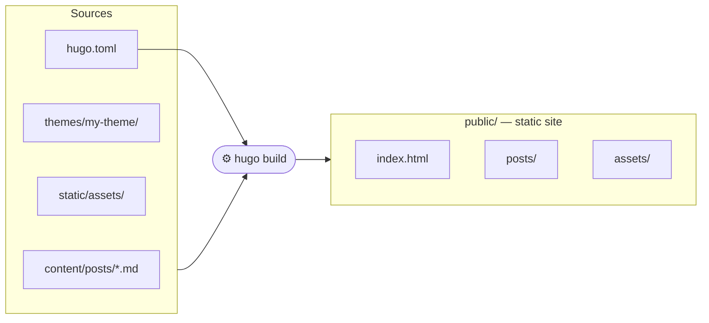
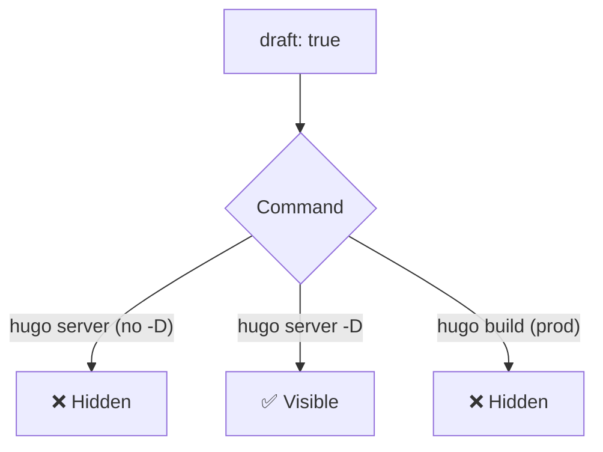
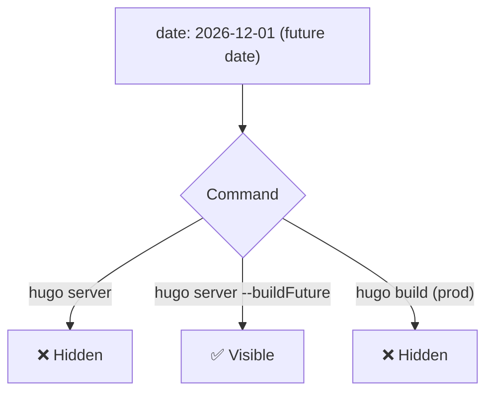
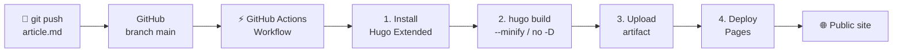

Ce blog a démarré sous Jekyll, le générateur de sites statiques historique de GitHub Pages. Après quelques mois d'utilisation, j'ai décidé de migrer vers Hugo. Voici pourquoi, et comment ça fonctionne.

## Jekyll vs Hugo : pourquoi changer ?

Jekyll est un outil solide, mais il traîne quelques contraintes qui deviennent pénibles avec le temps.

| | Jekyll | Hugo |
|---|---|---|
| Langage | Ruby | Go (binaire unique) |
| Installation | Ruby + Bundler + gems | Un seul binaire |
| Vitesse de build | Lente (secondes à minutes) | Très rapide (millisecondes) |
| Dépendances | Nombreuses (gems) | Aucune |
| Themes | Via gems ou fork | Répertoire local ou module |
| Drafts natifs | Partiel | Natif (`draft: true`) |
| Dates futures | Non géré nativement | Natif (`buildFuture`) |

Le point qui m'a le plus motivé : Hugo est un binaire unique compilé en Go. Pas de Ruby à installer, pas de conflits de versions de gems, pas de `bundle install` qui échoue selon l'environnement. On télécharge, on lance, c'est fini.

## Comment fonctionne Hugo ?

Hugo est un générateur de sites statiques : il prend des fichiers Markdown et des templates, et produit un site HTML/CSS/JS prêt à être hébergé n'importe où.



Chaque article est un fichier Markdown avec un en-tête appelé **frontmatter** (entre les `---`) qui définit les métadonnées de l'article : titre, date, tags, image de couverture, etc.

```markdown
---
title: "My article"
date: 2026-04-28T10:00:00+02:00
draft: false
tags:
  - kubernetes
  - devops
cover:
  image: assets/images/my-image.png
  alt: "Cover image description"
---

Article content in Markdown...
```

## Installation

### Sur Linux

Hugo propose des paquets pour les distributions courantes. La méthode la plus simple et la plus à jour est de télécharger le binaire directement depuis les releases GitHub.

```bash
# Download the Extended version (required for advanced CSS themes)
HUGO_VERSION="0.147.0"
wget -O /tmp/hugo.deb \
  https://github.com/gohugoio/hugo/releases/download/v${HUGO_VERSION}/hugo_extended_${HUGO_VERSION}_linux-amd64.deb

sudo dpkg -i /tmp/hugo.deb

# Verify installation
hugo version
```

Sur Debian/Ubuntu, il est aussi disponible via `apt`, mais souvent dans une version ancienne :

```bash
sudo apt install hugo
```

### Sur Windows

Sur Windows, la méthode recommandée est via **winget** ou **Chocolatey** :

```powershell
# Via winget (built-in on Windows 11)
winget install Hugo.Hugo.Extended

# Via Chocolatey
choco install hugo-extended
```

Ou bien télécharger le binaire `.zip` depuis les [releases GitHub de Hugo](https://github.com/gohugoio/hugo/releases) et l'ajouter au `PATH`.

Le mot clé `extended` est important : la version Extended inclut le support de Sass/SCSS, nécessaire pour la majorité des thèmes modernes.

## Créer un nouveau site

```bash
hugo new site my-blog
cd my-blog
```

Structure générée :

```
my-blog/
├── archetypes/       ← Article templates
├── content/          ← Content (articles, pages)
├── layouts/          ← HTML templates (theme overrides)
├── static/           ← Served as-is (images, favicon...)
├── themes/           ← Themes
└── hugo.toml         ← Main configuration
```

## Écrire un article

```bash
hugo new posts/2026-04-28-my-article.md
```

Hugo crée le fichier avec le frontmatter pré-rempli depuis l'archétype par défaut. Il suffit ensuite d'ouvrir le fichier et de rédiger le contenu en Markdown.

## Publier en draft

Tant qu'un article est en cours de rédaction, il suffit de conserver `draft: true` dans le frontmatter :

```markdown
---
title: "My draft article"
date: 2026-04-28T10:00:00+02:00
draft: true
---
```



Pour publier l'article, il suffit de passer `draft: false` ou de supprimer la ligne `draft`.

## Publier dans le futur

Hugo offre aussi la possibilité de planifier la publication d'un article via la date du frontmatter. Si la date est postérieure à la date actuelle, l'article est masqué par défaut lors du build.

```markdown
---
title: "Scheduled article"
date: 2026-12-01T09:00:00+02:00
draft: false
---
```



Combiné à une GitHub Action qui se déclenche tous les jours, cela permet une publication automatique à la date souhaitée sans aucune intervention manuelle.

## Lancer le serveur de développement

```bash
# Standard mode (published articles only)
hugo server

# Include drafts
hugo server -D

# Include drafts and future-dated articles
hugo server -D --buildFuture
```

Le serveur se lance sur [http://localhost:1313](http://localhost:1313) et se recharge automatiquement à chaque modification de fichier.

## Build et déploiement

Pour générer le site statique final :

```bash
hugo --gc --minify
```

Le résultat est dans le dossier `public/`, prêt à être déployé sur n'importe quel hébergeur statique (GitHub Pages, Netlify, Vercel, un simple serveur nginx...).

## Déploiement automatique avec GitHub Actions

GitHub Actions est un système d'intégration et de déploiement continu (CI/CD) intégré à GitHub. Il permet d'automatiser des tâches à chaque `git push` : dans notre cas, builder le site avec Hugo et le publier sur GitHub Pages, sans aucune intervention manuelle.



Le fichier de workflow se place dans `.github/workflows/hugo.yml`. Voici sa structure commentée :

```yaml
name: Deploy Hugo site to GitHub Pages

# Trigger: on every push to main branch
on:
  push:
    branches:
      - main
  workflow_dispatch: # also allows manual trigger from GitHub

# Permissions required to write to GitHub Pages
permissions:
  contents: read
  pages: write
  id-token: write

jobs:
  build:
    runs-on: ubuntu-latest
    steps:
      # 1. Install Hugo Extended on the runner
      - name: Install Hugo CLI
        run: |
          wget -O /tmp/hugo.deb \
            https://github.com/gohugoio/hugo/releases/download/v0.147.0/hugo_extended_0.147.0_linux-amd64.deb \
          && sudo dpkg -i /tmp/hugo.deb

      # 2. Checkout source code
      - name: Checkout
        uses: actions/checkout@v4

      # 3. Build the site (no drafts, no future dates)
      - name: Build with Hugo
        env:
          HUGO_ENVIRONMENT: production
        run: hugo --gc --minify --baseURL "https://mysite.github.io/"

      # 4. Upload artifact for the deploy job
      - name: Upload artifact
        uses: actions/upload-pages-artifact@v3
        with:
          path: ./public

  deploy:
    needs: build # waits for build job to complete
    runs-on: ubuntu-latest
    steps:
      # 5. Publish to GitHub Pages
      - name: Deploy to GitHub Pages
        uses: actions/deploy-pages@v4
```

Le point clé est à l'étape 3 : la commande `hugo` est lancée sans `-D` ni `--buildFuture`. Hugo exclut donc automatiquement tous les articles en `draft: true` ou dont la date est dans le futur.

| Article | `hugo server -D` | GitHub Actions (prod) |
|---|---|---|
| `draft: false`, date passée | visible | publié |
| `draft: true`, date passée | visible | masqué |
| `draft: false`, date future | masqué | masqué |
| `draft: true`, date future | masqué | masqué |

*`hugo server -D --buildFuture` affiche toutes les lignes du tableau.*

Les articles en `draft: true` ou avec une date future ne sont jamais inclus dans le build de production, ce qui garantit qu'aucun contenu non voulu ne se retrouve publié par erreur.

## Conclusion

La migration de Jekyll vers Hugo a été, pour moi, une évidence. La simplicité d'installation, la vitesse de build, et la gestion native des drafts et des dates futures en font un outil bien plus agréable au quotidien. Si tu héberges ton blog sur GitHub Pages et que tu utilises encore Jekyll, la migration vaut vraiment le coup.

## Sources

- [Documentation officielle de Hugo](https://gohugo.io/documentation/)
- [Releases Hugo sur GitHub](https://github.com/gohugoio/hugo/releases)
- [Thèmes Hugo](https://themes.gohugo.io/)
- [PaperMod - Thème utilisé sur ce blog](https://github.com/adityatelange/hugo-PaperMod)
