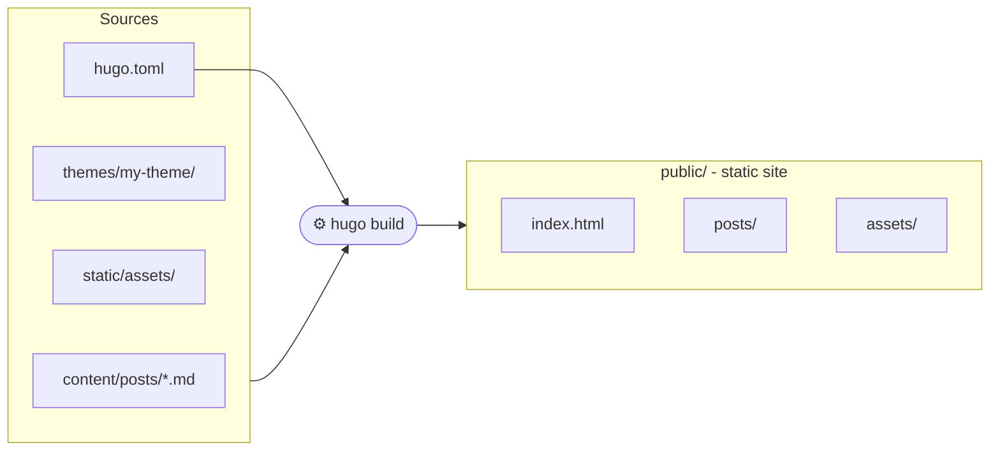
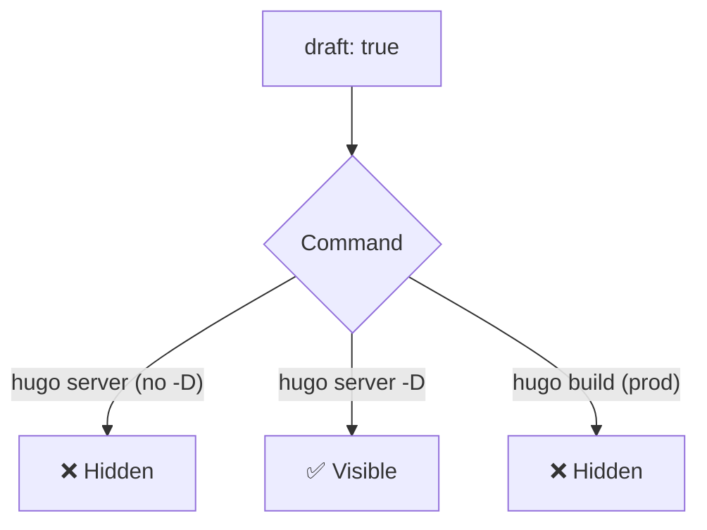
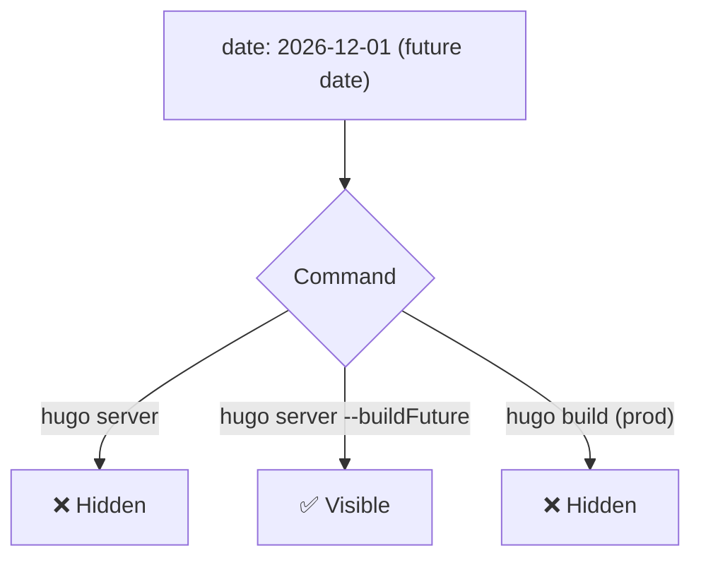
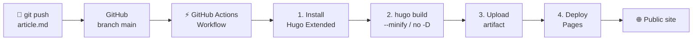

This blog started with Jekyll, the static site generator historically associated with GitHub Pages. After a few months of use, I decided to migrate to Hugo. Here's why, and how it works.

## Jekyll vs Hugo: why switch?

Jekyll is a solid tool, but it carries a few constraints that become painful over time.

| | Jekyll | Hugo |
|---|---|---|
| Language | Ruby | Go (single binary) |
| Installation | Ruby + Bundler + gems | One single binary |
| Build speed | Slow (seconds to minutes) | Very fast (milliseconds) |
| Dependencies | Many (gems) | None |
| Themes | Via gems or fork | Local directory or module |
| Native drafts | Partial | Native (`draft: true`) |
| Future dates | Not handled natively | Native (`buildFuture`) |

The point that motivated me most: Hugo is a single binary compiled in Go. No Ruby to install, no gem version conflicts, no `bundle install` failing depending on the environment. Download it, run it, done.

## How Hugo works

Hugo is a static site generator: it takes Markdown files and templates and produces an HTML/CSS/JS site ready to be hosted anywhere.



Each article is a Markdown file with a header called **frontmatter** (between the `---`) that defines the article's metadata: title, date, tags, cover image, etc.

```markdown
---
title: "My article"
date: 2026-04-28T10:00:00+02:00
draft: false
tags:
  - kubernetes
  - devops
cover:
  image: assets/images/my-image.png
  alt: "Cover image description"
---

Article content in Markdown...
```

## Installation

### On Linux

Hugo provides packages for common distributions. The simplest and most up-to-date method is to download the binary directly from the GitHub releases.

```bash
# Download the Extended version (required for advanced CSS themes)
HUGO_VERSION="0.147.0"
wget -O /tmp/hugo.deb \
  https://github.com/gohugoio/hugo/releases/download/v${HUGO_VERSION}/hugo_extended_${HUGO_VERSION}_linux-amd64.deb

sudo dpkg -i /tmp/hugo.deb

# Verify installation
hugo version
```

On Debian/Ubuntu, it's also available via `apt`, but often in an older version:

```bash
sudo apt install hugo
```

### On Windows

On Windows, the recommended method is via **winget** or **Chocolatey**:

```powershell
# Via winget (built-in on Windows 11)
winget install Hugo.Hugo.Extended

# Via Chocolatey
choco install hugo-extended
```

Or download the `.zip` binary from [Hugo's GitHub releases](https://github.com/gohugoio/hugo/releases) and add it to your `PATH`.

The `extended` keyword matters: the Extended version includes Sass/SCSS support, required by most modern themes.

## Creating a new site

```bash
hugo new site my-blog
cd my-blog
```

Generated structure:

```
my-blog/
├── archetypes/       ← Article templates
├── content/          ← Content (articles, pages)
├── layouts/          ← HTML templates (theme overrides)
├── static/           ← Served as-is (images, favicon...)
├── themes/           ← Themes
└── hugo.toml         ← Main configuration
```

## Writing an article

```bash
hugo new posts/2026-04-28-my-article.md
```

Hugo creates the file with the frontmatter pre-filled from the default archetype. Just open the file and write the content in Markdown.

## Publishing as a draft

While an article is being written, simply keep `draft: true` in the frontmatter:

```markdown
---
title: "My draft article"
date: 2026-04-28T10:00:00+02:00
draft: true
---
```



To publish the article, just switch `draft: false` or remove the `draft` line.

## Publishing in the future

Hugo also allows scheduling article publication via the frontmatter date. If the date is in the future, the article is hidden by default during the build.

```markdown
---
title: "Scheduled article"
date: 2026-12-01T09:00:00+02:00
draft: false
---
```



Combined with a GitHub Action that triggers daily, this enables automatic publication at the desired date without any manual intervention.

## Running the development server

```bash
# Standard mode (published articles only)
hugo server

# Include drafts
hugo server -D

# Include drafts and future-dated articles
hugo server -D --buildFuture
```

The server starts at [http://localhost:1313](http://localhost:1313) and reloads automatically on every file change.

## Build and deployment

To generate the final static site:

```bash
hugo --gc --minify
```

The result is in the `public/` folder, ready to be deployed on any static host (GitHub Pages, Netlify, Vercel, a simple nginx server...).

## Automated deployment with GitHub Actions

GitHub Actions is a continuous integration and deployment (CI/CD) system built into GitHub. It allows automating tasks on every `git push`: in our case, building the site with Hugo and publishing it to GitHub Pages, with no manual intervention.



The workflow file lives in `.github/workflows/hugo.yml`. Here is its commented structure:

```yaml
name: Deploy Hugo site to GitHub Pages

# Trigger: on every push to main branch
on:
  push:
    branches:
      - main
  workflow_dispatch: # also allows manual trigger from GitHub

# Permissions required to write to GitHub Pages
permissions:
  contents: read
  pages: write
  id-token: write

jobs:
  build:
    runs-on: ubuntu-latest
    steps:
      # 1. Install Hugo Extended on the runner
      - name: Install Hugo CLI
        run: |
          wget -O /tmp/hugo.deb \
            https://github.com/gohugoio/hugo/releases/download/v0.147.0/hugo_extended_0.147.0_linux-amd64.deb \
          && sudo dpkg -i /tmp/hugo.deb

      # 2. Checkout source code
      - name: Checkout
        uses: actions/checkout@v4

      # 3. Build the site (no drafts, no future dates)
      - name: Build with Hugo
        env:
          HUGO_ENVIRONMENT: production
        run: hugo --gc --minify --baseURL "https://mysite.github.io/"

      # 4. Upload artifact for the deploy job
      - name: Upload artifact
        uses: actions/upload-pages-artifact@v3
        with:
          path: ./public

  deploy:
    needs: build # waits for build job to complete
    runs-on: ubuntu-latest
    steps:
      # 5. Publish to GitHub Pages
      - name: Deploy to GitHub Pages
        uses: actions/deploy-pages@v4
```

The key point is step 3: the `hugo` command is run without `-D` or `--buildFuture`. Hugo automatically excludes all articles with `draft: true` or a future date.

| Article | `hugo server -D` | GitHub Actions (prod) |
|---|---|---|
| `draft: false`, past date | visible | published |
| `draft: true`, past date | visible | hidden |
| `draft: false`, future date | hidden | hidden |
| `draft: true`, future date | hidden | hidden |

*`hugo server -D --buildFuture` shows all rows of the table.*

Articles with `draft: true` or a future date are never included in the production build, guaranteeing that no unwanted content ends up published by mistake.

## Conclusion

Migrating from Jekyll to Hugo was, for me, an obvious choice. The simplicity of installation, build speed, and native handling of drafts and future dates make it a much more pleasant tool to use day-to-day. If you host your blog on GitHub Pages and are still using Jekyll, the migration is definitely worth it.

## Sources

- [Official Hugo documentation](https://gohugo.io/documentation/)
- [Hugo releases on GitHub](https://github.com/gohugoio/hugo/releases)
- [Hugo themes](https://themes.gohugo.io/)
- [PaperMod - Theme used on this blog](https://github.com/adityatelange/hugo-PaperMod)
