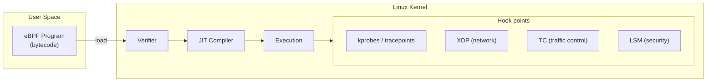
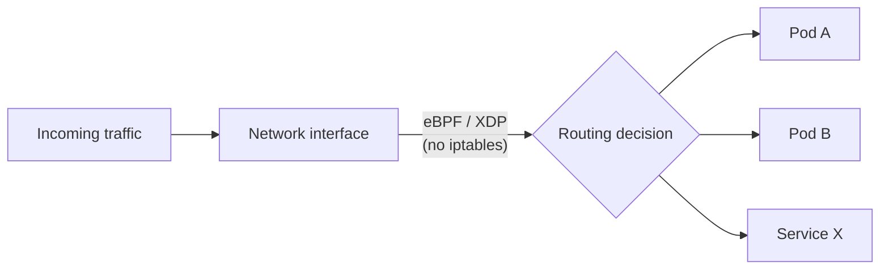
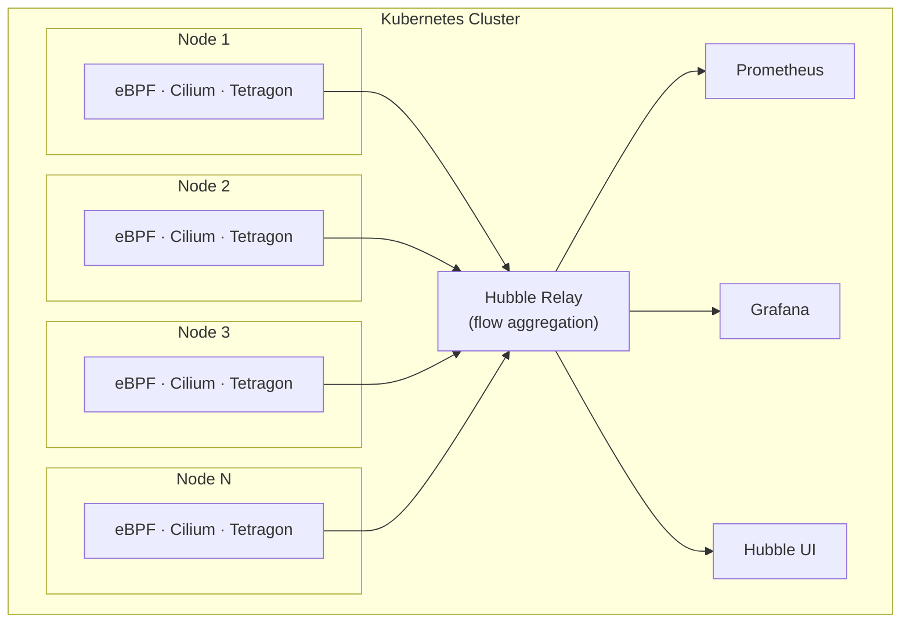

Il y a quelques années, eBPF (Extended Berkeley Packet Filter) était encore perçu comme une technologie réservée aux experts du noyau Linux. En 2026, la donne a changé : eBPF est devenu un composant fondamental des clusters Kubernetes en production. Retour sur cette évolution et sur ce que cela signifie concrètement au quotidien.

## Rappel : qu'est-ce qu'eBPF ?

eBPF est un mécanisme du noyau Linux permettant d'exécuter des programmes sandboxés directement dans le contexte du noyau, sans modifier son code source ni charger de module. Ces programmes sont vérifiés statiquement par le noyau avant leur exécution, ce qui garantit qu'ils ne peuvent ni planter le système ni en compromettre la sécurité.



L'intérêt majeur pour Kubernetes est que ces programmes peuvent observer et agir sur le réseau, les syscalls, et les événements du noyau à très faible coût, sans instrumentation du code applicatif.

## L'écosystème eBPF dans Kubernetes en 2026

### Réseau : Cilium s'impose comme référence

Cilium est aujourd'hui le CNI (Container Network Interface) le plus déployé dans les environnements Kubernetes exigeants. En s'appuyant sur eBPF pour remplacer `iptables` et `kube-proxy`, Cilium offre :

- Un acheminement des paquets directement dans le noyau via XDP, sans passer par la pile réseau classique
- Une politique réseau (NetworkPolicy) évaluée à la source plutôt qu'à la destination
- Un remplacement de `kube-proxy` avec des performances nettement supérieures à grande échelle



En 2026, le mode « KubeProxy Replacement » de Cilium est activé par défaut dans de nombreuses distributions managées (EKS, GKE, AKS).

### Sécurité : Tetragon et l'observation des syscalls

Tetragon (projet CNCF issu de Cilium) permet d'observer et de bloquer des comportements malveillants directement au niveau du noyau, sans agent dans le pod. Il peut, par exemple :

- Détecter un `exec` inattendu dans un conteneur (exécution d'un shell depuis une app web)
- Bloquer un accès réseau non autorisé avant même qu'il ne soit établi
- Tracer les accès fichiers sensibles en temps réel

La force de Tetragon est d'agir en amont, au niveau du noyau, ce qui rend le contournement par l'attaquant bien plus difficile que des solutions basées sur des logs applicatifs.

### Observabilité : Hubble et la visibilité réseau native

Hubble, composant de Cilium, expose une visibilité complète sur les flux réseau entre pods, services et namespaces, sans aucun sidecar. En 2026, son interface graphique et son intégration avec Prometheus/Grafana sont matures et adoptées en production.

Points forts de Hubble :
- Visualisation des flux L3/L4/L7 (HTTP, gRPC, DNS)
- Alertes sur les connexions rejetées par les NetworkPolicies
- Intégration native avec OpenTelemetry

### Performance : mesures et bpftrace

Pour les équipes SRE ou les profils orientés performance, `bpftrace` reste l'outil de référence pour l'investigation à chaud sur un noeud Kubernetes. Il permet d'écrire des scripts one-liner pour tracer la latence des appels système, l'utilisation CPU par cgroup, ou encore les accès disque par pod.

```bash
# Example: read() latency per container
bpftrace -e 'kretprobe:vfs_read { @[comm] = hist(retval); }'
```

## Architecture typique d'un cluster en production

Voici une vue simplifiée d'un cluster Kubernetes avec eBPF en 2026 :



## Du PoC à la production : points d'attention

### Compatibilité du noyau Linux

eBPF évolue rapidement et certaines fonctionnalités requièrent des versions récentes du noyau. En production, il faut vérifier la compatibilité entre la version du noyau des noeuds et les fonctionnalités utilisées.

| Fonctionnalité | Version noyau minimale recommandée |
|---|---|
| Cilium (base) | 4.19 |
| Cilium KubeProxy Replacement | 5.10 |
| Tetragon (LSM hooks) | 5.15 |
| BTF (debug info) | 5.8 |

### Gestion des droits et sécurité

Les programmes eBPF nécessitent des privilèges élevés au chargement. En production, cela se traduit par :
- Des DaemonSets avec des capabilities Linux spécifiques (`CAP_BPF`, `CAP_NET_ADMIN`)
- Une politique de PodSecurity adaptée (privileged ou custom)
- Un audit des programmes chargés via les outils dédiés

### Observabilité de l'eBPF lui-même

Un point souvent négligé : il faut aussi surveiller la santé des composants eBPF eux-mêmes. Cilium et Tetragon exposent des métriques Prometheus sur :
- Le nombre de programmes eBPF chargés
- L'utilisation des maps eBPF (structures de données partagées entre noyau et espace utilisateur)
- Les erreurs de vérification ou de chargement

### Mises à jour et rolling upgrades

La mise à jour de Cilium sur un cluster en production requiert une stratégie de rolling upgrade soignée. En 2026, les opérateurs Helm et les outils de gestion comme `cilium-cli` ont simplifié ce processus, mais il reste un point critique à tester en staging avant toute mise en production.

## Ce qui reste un défi

Malgré la maturité croissante, plusieurs défis subsistent :

- **Debuggabilité** : tracer un problème réseau ou sécurité lié à un programme eBPF reste complexe pour les équipes sans expertise noyau.
- **Portabilité** : eBPF dépend fortement de la version du noyau et de l'architecture matérielle (x86-64, ARM64). Les environnements hétérogènes compliquent les déploiements.
- **Documentation** : si la documentation de Cilium est excellente, celle de certains outils périphériques (bpftrace, scripts customs) manque encore de maturité.
- **Formation des équipes** : la courbe d'apprentissage reste significative pour les profils ops/devops qui ne sont pas familiers avec les concepts bas niveau du noyau.

## Conclusion

eBPF a tenu ses promesses en Kubernetes. En 2026, il ne s'agit plus d'une technologie de niche mais d'une fondation sur laquelle reposent des fonctionnalités critiques : réseau haute performance, sécurité en profondeur, et observabilité sans surcoût. Les distributions Kubernetes intègrent ces composants par défaut, et les équipes qui n'ont pas encore franchi le pas ont désormais accès à une documentation, des outils, et une communauté matures.

Pour les équipes qui souhaitent démarrer, je recommande de commencer par Cilium en remplacement de `kube-proxy`, puis d'explorer Hubble pour la visibilité réseau avant de s'attaquer à des cas d'usage de sécurité plus avancés avec Tetragon.

## Sources

- [Documentation officielle de Cilium](https://docs.cilium.io/)
- [Tetragon - Projet CNCF](https://tetragon.io/)
- [eBPF.io - Hub de la communauté eBPF](https://ebpf.io/)
- [Hubble - Observabilité réseau pour Kubernetes](https://github.com/cilium/hubble)
- [bpftrace - Référence des one-liners](https://github.com/bpftrace/bpftrace)
- [CNCF eBPF Landscape 2025](https://landscape.cncf.io/)
