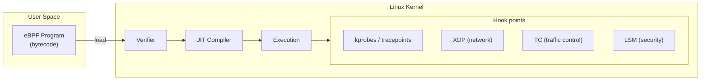
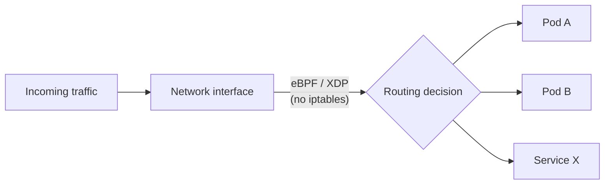
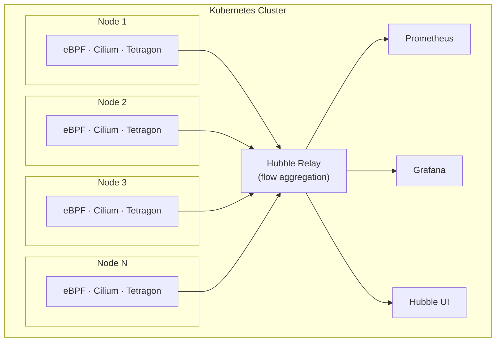

A few years ago, eBPF (Extended Berkeley Packet Filter) was still seen as a technology reserved for Linux kernel experts. By 2026, the landscape has shifted: eBPF has become a fundamental component of production Kubernetes clusters. Here's a look back at that evolution and what it means concretely on a day-to-day basis.

## Recap: what is eBPF?

eBPF is a Linux kernel mechanism that allows sandboxed programs to run directly in the kernel context, without modifying kernel source code or loading a kernel module. These programs are statically verified by the kernel before execution, ensuring they can neither crash the system nor compromise its security.



The major advantage for Kubernetes is that these programs can observe and act on networking, syscalls, and kernel events at very low cost, without instrumenting application code.

## The eBPF ecosystem in Kubernetes in 2026

### Networking: Cilium emerges as the reference

Cilium is today the most widely deployed CNI (Container Network Interface) in demanding Kubernetes environments. By leveraging eBPF to replace `iptables` and `kube-proxy`, Cilium offers:

- Packet forwarding directly in the kernel via XDP, bypassing the traditional network stack
- Network policy (NetworkPolicy) evaluated at the source rather than the destination
- A `kube-proxy` replacement with significantly better performance at scale



In 2026, Cilium's "KubeProxy Replacement" mode is enabled by default in many managed distributions (EKS, GKE, AKS).

### Security: Tetragon and syscall observation

Tetragon (a CNCF project from the Cilium team) allows observing and blocking malicious behavior directly at the kernel level, without an agent inside the pod. It can, for example:

- Detect an unexpected `exec` inside a container (shell execution from a web app)
- Block an unauthorized network connection before it is even established
- Trace access to sensitive files in real time

Tetragon's strength is acting upstream, at the kernel level, making it much harder for an attacker to bypass than solutions based on application logs.

### Observability: Hubble and native network visibility

Hubble, a Cilium component, exposes complete visibility into network flows between pods, services, and namespaces, without any sidecar. In 2026, its graphical interface and integration with Prometheus/Grafana are mature and adopted in production.

Hubble highlights:
- L3/L4/L7 flow visualization (HTTP, gRPC, DNS)
- Alerts on connections rejected by NetworkPolicies
- Native integration with OpenTelemetry

### Performance: measurements and bpftrace

For SRE teams or performance-focused engineers, `bpftrace` remains the go-to tool for live investigation on a Kubernetes node. It lets you write one-liner scripts to trace syscall latency, CPU usage by cgroup, or disk access by pod.

```bash
# Example: read() latency per container
bpftrace -e 'kretprobe:vfs_read { @[comm] = hist(retval); }'
```

## Typical production cluster architecture

Here is a simplified view of a Kubernetes cluster with eBPF in 2026:



## From PoC to production: key considerations

### Linux kernel compatibility

eBPF evolves rapidly and some features require recent kernel versions. In production, you need to verify compatibility between your nodes' kernel version and the features you intend to use.

| Feature | Minimum recommended kernel version |
|---|---|
| Cilium (base) | 4.19 |
| Cilium KubeProxy Replacement | 5.10 |
| Tetragon (LSM hooks) | 5.15 |
| BTF (debug info) | 5.8 |

### Permissions and security management

eBPF programs require elevated privileges at load time. In production, this translates to:
- DaemonSets with specific Linux capabilities (`CAP_BPF`, `CAP_NET_ADMIN`)
- An adapted PodSecurity policy (privileged or custom)
- An audit of loaded programs via dedicated tools

### Observability of eBPF itself

An often overlooked point: you also need to monitor the health of the eBPF components themselves. Cilium and Tetragon expose Prometheus metrics on:
- The number of loaded eBPF programs
- eBPF map usage (data structures shared between kernel and user space)
- Verification or loading errors

### Updates and rolling upgrades

Updating Cilium on a production cluster requires a careful rolling upgrade strategy. In 2026, Helm operators and tools like `cilium-cli` have simplified this process, but it remains a critical point to test in staging before any production rollout.

## What remains challenging

Despite growing maturity, several challenges persist:

- **Debuggability**: tracing a networking or security issue related to an eBPF program remains complex for teams without kernel expertise.
- **Portability**: eBPF depends heavily on the kernel version and hardware architecture (x86-64, ARM64). Heterogeneous environments complicate deployments.
- **Documentation**: while Cilium's documentation is excellent, some peripheral tools (bpftrace, custom scripts) still lack maturity.
- **Team training**: the learning curve remains significant for ops/devops profiles unfamiliar with low-level kernel concepts.

## Conclusion

eBPF has delivered on its promises in Kubernetes. By 2026, it is no longer a niche technology but a foundation upon which critical features rest: high-performance networking, defense-in-depth security, and observability without overhead. Kubernetes distributions integrate these components by default, and teams that haven't yet made the switch now have access to mature documentation, tools, and a thriving community.

For teams looking to get started, I recommend beginning with Cilium as a `kube-proxy` replacement, then exploring Hubble for network visibility before tackling more advanced security use cases with Tetragon.

## Sources

- [Official Cilium documentation](https://docs.cilium.io/)
- [Tetragon - CNCF Project](https://tetragon.io/)
- [eBPF.io - eBPF community hub](https://ebpf.io/)
- [Hubble - Network observability for Kubernetes](https://github.com/cilium/hubble)
- [bpftrace - One-liner reference](https://github.com/bpftrace/bpftrace)
- [CNCF eBPF Landscape 2025](https://landscape.cncf.io/)
